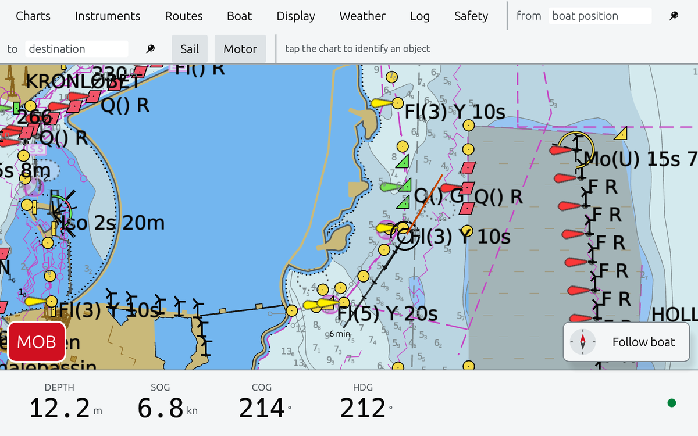
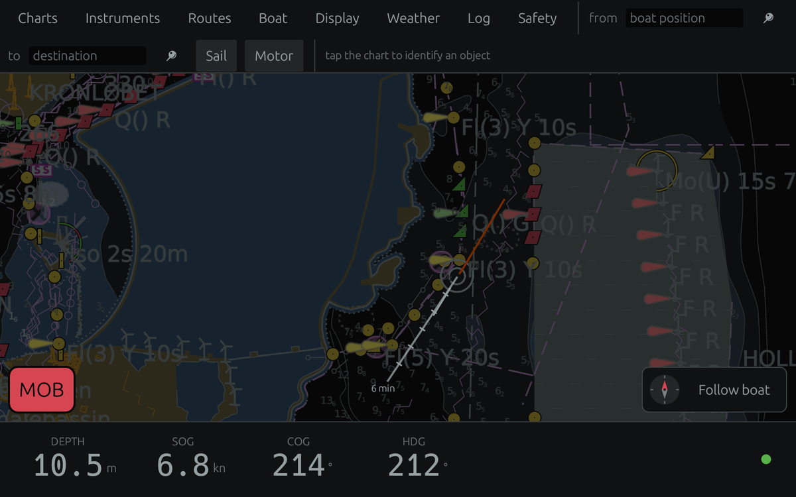
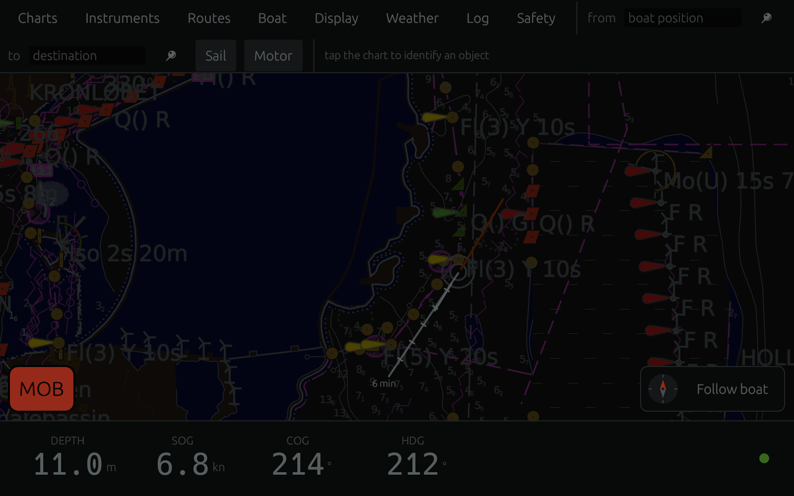
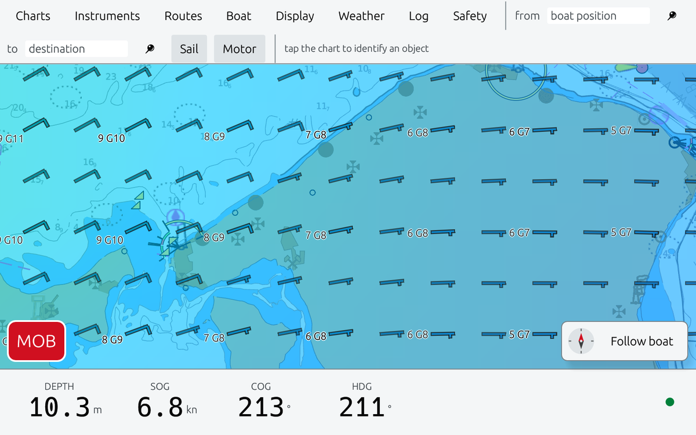
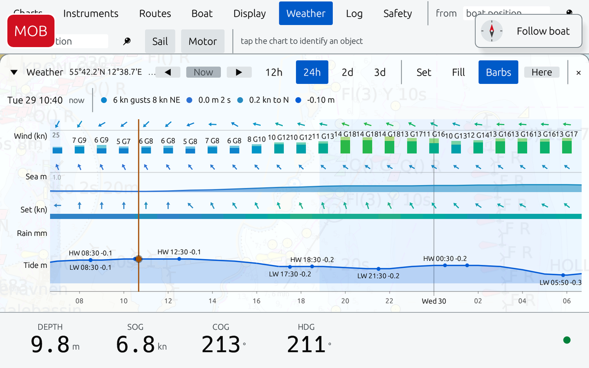

# Manx

A fast, light chart plotter for the Raspberry Pi, Linux, macOS, Windows and Android.

**Beta. Not for navigation.** [Download](https://github.com/den200/manx/releases/latest) · [Features](#features) · [Screenshots](#screenshots) · [Performance](#performance)

## Why Manx

I'm Denis. I own a boat, and I couldn't stop myself geeking around with AI to see if I could build a brand-new chart plotter that runs smoothly on computers like the Raspberry Pi and Odroid.

OpenCPN was too slow for me, and fixing it looked harder than starting over. Raspberry Pis are on more and more boats, and they deserve a plotter built for them. So Manx is written in Rust and draws with Vulkan: fast, light, modern, built to last.

This is the result of about ten months of trial and error. It wouldn't have been possible without projects like [OpenCPN](https://opencpn.org).

A chart plotter can be blazing fast. Manx proves it.

## Features

- **Charts.** S-52, drawn as the standard says. o-charts and free NOAA ENCs.
- **Chart shop.** Buy o-charts or download NOAA charts in the app.
- **Day, Dusk, Night.** IHO colours. The interface dims with the chart.
- **Signal K.** The only data source, so there is one thing to set up.
- **AIS.** Targets and CPA alarms.
- **Routes.** Plan on the chart. GPX in and out. Shared with Signal K.
- **Weather.** Wind and gusts, waves, currents, rain, tides.
- **Weather routing.** Isochrones with your boat's polar.
- **Safety.** MOB, anchor watch, alarms, logbook.
- **Touch first.** Big targets. North-up, head-up, two-finger twist.

## Screenshots

| Dusk palette | Night palette |
|---|---|
|  |  |

| Wind and gusts over the Kattegat | Forecast for where you are |
|---|---|
|  |  |

## Performance

Raspberry Pi 5 (4 GB) at 1920 × 1080, NOAA charts of San Diego.

| | Panning and zooming every frame | View held still |
|---|---|---|
| Frame rate | 60 fps (display limit) | — |
| Frame time, 95th percentile | 16.8 ms | — |
| CPU | 28 % of one core | 0 % |
| GPU | 19 % busy | 0 % |
| Memory | 242 MB (263 MB peak) | 229 MB |

Measured with `MANX_PROFILE=1 MANX_STRESS=coast` and the rig's sampler ([doc/pi5-test-rig.md](doc/pi5-test-rig.md)).

## Download

[Latest release](https://github.com/den200/manx/releases/latest):

- **Raspberry Pi 5** and other 64-bit ARM Linux, like Odroid
- **Linux** PCs (x86_64)
- **macOS** (Apple silicon)
- **Android** (64-bit ARM, like the ODROID-C5)
- **Windows** (x86_64): free charts for now; o-charts not yet

Unpack and run `manx`. Setup and o-charts: [deploy/INSTALL.md](deploy/INSTALL.md).

To build it yourself: `cargo run --release -- /path/to/charts`. Raspberry Pi: [deploy/README.md](deploy/README.md). Android: [deploy/ANDROID.md](deploy/ANDROID.md).

## The name

In the 1950s a Manx shearwater was flown from Wales to Boston and released. Twelve days later it was back in its burrow, 5,000 km across unfamiliar ocean.

## Thanks

- **[OpenCPN](https://opencpn.org)** taught us how charts are drawn. Parts of Manx come from it.
- **[o-charts](https://o-charts.org)** for affordable official charts, and `oexserverd` to read them.
- **[Signal K](https://signalk.org)** for one open language on board.
- **[AvNav](https://www.wellenvogel.net/software/avnav/docs/beschreibung.html)** showed a light plotter on a Pi works.
- **[QuteNav](https://github.com/jusirkka/qutenav)** showed o-charts outside OpenCPN.
- **[IHO S-52](https://iho.int)**, **[NOAA](https://www.noaa.gov)**, **[Open-Meteo](https://open-meteo.com)**, **[Natural Earth](https://www.naturalearthdata.com)**, **[wgpu](https://wgpu.rs)**, **[egui](https://www.egui.rs)** and the Rust community.

## License

[GPL-3.0-or-later](COPYING). Parts are derived from OpenCPN (GPLv2 or later), © David S. Register and the OpenCPN contributors.

Not for navigation. Always carry official charts.
